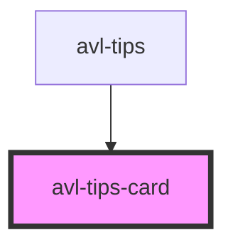

# my-component

<!-- Auto Generated Below -->

## Properties

| Property   | Attribute  | Description | Type     | Default     |
| ---------- | ---------- | ----------- | -------- | ----------- |
| `cash`     | `cash`     |             | `string` | `undefined` |
| `employer` | `employer` |             | `string` | `undefined` |
| `name`     | `name`     |             | `string` | `undefined` |
| `paypal`   | `paypal`   |             | `string` | `undefined` |
| `venmo`    | `venmo`    |             | `string` | `undefined` |

## Dependencies

### Used by

 - [avl-tips](../tips)

### Graph

----------------------------------------------

*Built with [StencilJS](https://stenciljs.com/)*
